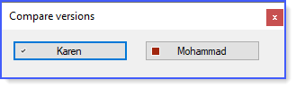

# About

This project shows how when a coder does not understand asynchronous operations in regards to keeping a front-end responsive while reading data using Entity Framework can keep the front-end responsive.

**GetContactsAsync** wraps the read operation in a ```task``` while **GetContactsAsync** does not and by not means the front-end will not keep things responsive.




```csharp
Public Class ContactOperations
    Public Shared Async Function GetContactsAsync() As Task(Of List(Of Contacts))
        Return Await Task.Run(Async Function()
              Using context = New NorthWindContext()
                  Return Await context.Contacts.Include(Function(contact) contact.ContactTypeIdentifierNavigation).ToListAsync()
              End Using
          End Function)
    End Function
    Public Shared Async Function GetContactsAsync1() As Task(Of List(Of Contacts))
        Using context = New NorthWindContext()
            Return Await context.Contacts.Include(Function(contact) contact.ContactTypeIdentifierNavigation).ToListAsync()
        End Using
    End Function
End Class
```