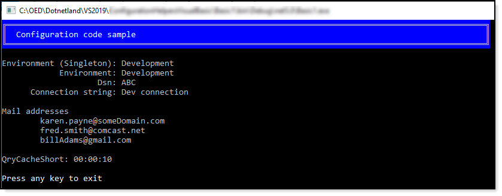

# About

In the .NET Framework prior to .NET Core application settings were in  [app.config](https://docs.microsoft.com/en-us/dotnet/framework/configure-apps/) file. 
All settings e.g. database connection, email setting etc in one file along with each 
setting are strings which need to be converted to proper types (see [the following](https://github.com/karenpayneoregon/configuration-helpers) for conversions) 
plus some functionality is missing like smtp sections. Moving to .NET Core, the standard is using 
a Json file generally named appsettings.json. The intent here is to layout how to use appsettings.json 
for desktop applications.

### Make sure

To read the `readme.md` files in the root of each project along with several have sub `readme.md` files in folders in some of the projects.

### Note 1

There are a mixture of the following projects

- .NET Framework
- .NET Framework Core

### Note 2

- There are examples for both `app.config` and 'appsettings.json' along with conventional `My.Settings` as some developers have a perference while others are open to alternative ways to store information.

# Requires


:heavy_check_mark: Visual Studio 2019 or higher
:heavy_check_mark: Create and populate the following database using [this script](https://gist.github.com/karenpayneoregon/9bdf1a7d5310ac1d562b2326d79d6038).

### NuGet packages

:heavy_check_mark: [microsoft.extensions.configuration](https://www.nuget.org/packages/Microsoft.Extensions.Configuration/) <br/>
:heavy_check_mark: [microsoft.extensions.configuration.binder](https://www.nuget.org/packages/Microsoft.Extensions.Configuration.Binder/)<br/>
:heavy_check_mark: [microsoft.extensions.configuration.FileExensions](https://www.nuget.org/packages/Microsoft.Extensions.Configuration.FileExtensions/)<br/>
:heavy_check_mark: [microsoft.extensions.configuration.Json](https://www.nuget.org/packages/Microsoft.Extensions.Configuration.Json/)

# GitHub repository

https://github.com/karenpayneoregon/configuration-helpers-vb

# Microsoft TechNet Article

https://social.technet.microsoft.com/wiki/contents/articles/54273.configuration-files-for-windows-forms-vb-net.aspx

# Sample configurations

**Examples 1**

```json
{
  "GeneralSettings": {
    "LogExceptions": true,
    "DatabaseSettings": {
      "DatabaseServer": ".\\SQLEXPRESS",
      "Catalog": "School",
      "IntegratedSecurity": true,
      "UsingLogging": true
    },
    "EmailSettings": {
      "Host": "smtp.gmail.com",
      "Port": 587,
      "EnableSsl": true,
      "DefaultCredentials": false,
      "PickupDirectoryLocation": "MailDrop"
    }
  }
}
```

**Example 2**

This one may not have the best names for properties although that is not really a problem especially when it's easy to setup alias for a property.

```json
{

  "Environment": {
    "Name": "Development"
  },
  "GeneralSettings": [
    {
      "Environment": "Development",
      "ReloadApplicationOnEveryRequest": true,
      "Trace": false,
      "Reload": "reload",
      "Password": true,
      "ConnectionString": "Dev connection",
      "DiConfiguration": {
        "Dsn": "ABC",
        "Globals": "globals",
        "Globals2": "globals2",
        "MailTo": "karen.payne@someDomain.com;fred.smith@comcast.net;billAdams@gmail.com",
        "ExitLink": "/ocs4/",
        "OcsLink": null,
        "MfLink": "",
        "MfUser": null,
        "MfPass": "",
        "UseGeoLocation": true,
        "ResetPinLocation": "/pinchange/begin/",
        "BaseServerAddress": "xxx4",
        "UirTakeTest": false,
        "QryCacheShort": "00:00:10",
        "QryCacheLong": "00:00:05"
      }
    },
    {
      "Environment": "Test",
      "ReloadApplicationOnEveryRequest": false,
      "Trace": false,
      "Reload": "reload",
      "Password": true,
      "ConnectionString": "Test connection",
      "DiConfiguration": {
        "Dsn": "DEF",
        "Globals": "globals",
        "Globals2": "globals2",
        "MailTo": "karen.payne@someDomain.com;fred.smith@comcast.net;billAdams@gmail.com",
        "ExitLink": "/ocs4/",
        "OcsLink": null,
        "MfLink": "",
        "MfUser": null,
        "MfPass": "",
        "UseGeoLocation": true,
        "ResetPinLocation": "/pinchange/begin/",
        "BaseServerAddress": "xxx4",
        "UirTakeTest": false,
        "QryCacheShort": "00:10:00",
        "QryCacheLong": "00:01:00"
      }
    },
    {
      "Environment": "Production",
      "ReloadApplicationOnEveryRequest": false,
      "Trace": false,
      "Reload": "reload",
      "Password": true,
      "ConnectionString": "Prod connection",
      "DiConfiguration": {
        "Dsn": "GHI",
        "Globals": "globals",
        "Globals2": "globals2",
        "MailTo": "karen.payne@someDomain.com;fred.smith@comcast.net;billAdams@gmail.com",
        "ExitLink": "/ocs4/",
        "OcsLink": null,
        "MfLink": "",
        "MfUser": null,
        "MfPass": "",
        "UseGeoLocation": true,
        "ResetPinLocation": "/pinchange/begin/",
        "BaseServerAddress": "xxx4",
        "UirTakeTest": false,
        "QryCacheShort": "06:00:00",
        "QryCacheLong": "00:30:00",
        "ConnectionString": "Prod connection"
      }
    }
  ]
}
```



# C# version

These code samples were the base for this repository and do different examples.

:heavy_check_mark: [Article](https://social.technet.microsoft.com/wiki/contents/articles/54173.net-core-desktop-application-configurations-c.aspx)

:heavy_check_mark: [repostory](https://github.com/karenpayneoregon/configuration-helpers)

# Entity Framework connection at runtime

This [repository](https://github.com/karenpayneoregon/EntityFramework-environment-connections) shows how to setup connection strings for different environments e.g. development, staging and production. This isolates operations so a developer can develop, testers can test without disturbing the production environment.


